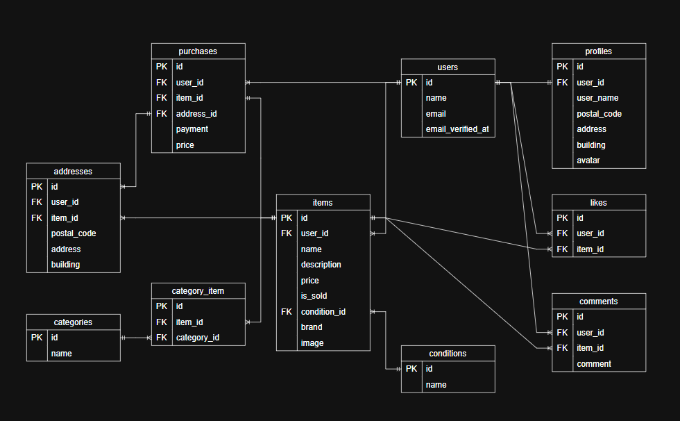

# メルカリ風フリマアプリ

## アプリ概要

メルカリ風のフリマアプリです。 
ユーザーが商品を出品・購入できます。

 

### 機能一覧
- ユーザー登録 / ログイン
- 商品一覧表示
- 商品詳細表示
- 商品出品
- 商品購入
- いいね機能
- コメント機能
- プロフィール編集

 

## 環境構築

### Dockerビルド

- git clone git@github.com:RumOff/coachtech-flea-market.git
- docker-compose up -d --build

### Laravel環境構築

- docker-compose exec php bash
- composer install
- cp .env.example .env ,,,環境変数を適宜変更してください
- php artisan key:generate
- php artisan migrate
- php artisan db:seed

 

## 開発環境(VSCode)
本プロジェクトは **Dev Containers** を使用して開発しています。 
VSCodeで以下の手順を実行するとコンテナに接続できます。

1. VSCodeでプロジェクトを開く
2. 左下の「><」または Ctrl+Shift+P を押下
3. 「Dev Containers: Attach to Running Container」を選択
4. `php` コンテナにアタッチ

 

## 開発環境(URL)

- 商品一覧画面: http://localhost/
- ユーザー登録: http://localhost/register
- phpMyAdmin: http://localhost:8080/

 

## 使用技術(実行環境)

- PHP 8.5.2
- Laravel 8.83.29
- MySQL Ver 8.0.26
- nginx 1.21.1

 

## ER図

